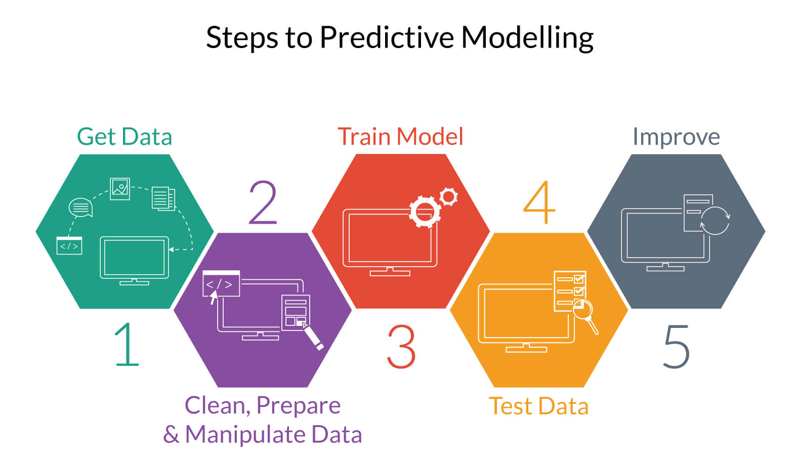

# Notes on the Galopp Project

This project is intended to predict the winner (/the winning order) of horses in a horse race. I have not seen a good implementation, and I expect to not be better than other people (professionals). However I wanted to give this a shot, because it consists of all the parts of a real machine learning pipeline.

I will try to split each step into one mini-project on its own, for better readability, interpretation and maintenance. I intend to skip the last step, the improving of the steps before, because I want to preserve my initial attempt at this project and go into the next one with all the take aways and improvement points I get. For this reason I keep track of a TODO list (TODO SEE BELOW). Also for my understanding it is not necessary to have a extra mini-project for the 'Train Model' part, I am going to integrate the testing of the model directly after i've fitted it before.

These are my notes and thoughts on the problems i have faced developing this project. Nothing is optimized and everything is far from perfection.

## Get Data

For getting the data i first had to choose from where i am going to get it. I did not just wanted to download it from [Kaggle] (like i mostly do), instead, I wanted to try building a simple scraper. The website I chose is [Galopp]. It is a german website for horse races and has a dedicated website for each race, so it is not a dynamic website with javascript content that is harder to capture. Also the website makes browsing for the desired information/elements quite easy, because everything is properly named across multiple race_ids (This was not always the case for others).

Most webscrapers having an architecture like:

For this project, this is a bit of a stretch, so I chose to not using an Scheduler and a Queue with URL's. They are not necessary here because the scraper stays on the same domain and  does not collect external links to different websites. My choice on the library of the scraper was [BeautifulSoup]. It is easy to browse static websites with it by the tags and the class names of them. Because the website is just like that, these two seemed like a good choice.

The scraping itself is easy and follows these steps:
- Request website with id = x (where x is given from [mininum_id, maximum_id])
- Get the information from the 1, 2, 3, 4 tags (see website sample image)
- Get all horse cells, loop through them and get all their information (the 5 in the image)
- Put all together and save

To mention is that:
1. The saving of the information happens in chunks of 2000 IDs. This is due to the memory consumption when having everything in RAM. So every 2000 IDs everything gets saved and then discarded from RAM. I have reduced the RAM usage by approx. 40-50% (I did not measure prefectly, only with a Ubuntu memory usage widget)
2. Everything happens in a multithreading loop, so it is much quicker than loading each page back to back.
3. The result splits get automatically merged at the end by the program, so no worries for the user to merge them when working with them.
4. The scraped information are NOT cleaned. For any field. This is because i want to do that strictly in the next section of this project. This leads to a bigger, uncleaned output dataset. ("Big", they are just ~9200 races with 8 attributes resulting in a 10 MB dataset, so it is not really big)

## Clean, Prepare & Manipulate

## Train Model & Test Data

## Improvement Ideas

### Donations

* BTC: 1DixZsj9HdRMCD16co1BbhXfJoaUrEptcE 
* ETH: 0xf5d23ad5b592a6f078ca18aa5eecc55edb1ce532

This Markdown site was created using [Dillinger]!

WEBCRAWLER ARCHITECTURE FROM WIKIPEADIA, CITATION TO BE DONE

[//]: # (These are reference links used in the body)
   [PyQt5]: <https://riverbankcomputing.com/software/pyqt/downloadr>
   [Galopp]: <https://www.galopp-statistik.de/>
   [BeautifulSoup]: <https://www.crummy.com/software/BeautifulSoup/>
   [Kaggle]: <https://www.kaggle.com/>
   [Dillinger]: <https://dillinger.io/>

